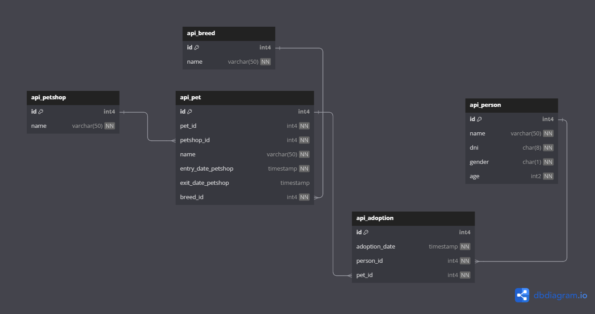

# django-restapi-petshop
This respository contains an django rest api example relate to petshop

### Technologies
* Django rest framework
* Django Models
* Django Serializers
* Django pylint
* PostgreSQL

### Startup
```
pipenv sync (intall depdency versions defined on Pipfile.lock)
py manage.py makemigrations
py manahe.py migrate
py manage.py runserver
```

### Database Diagram


# Postman Collection
[petshop_collection](docs/petshop_collection.json)